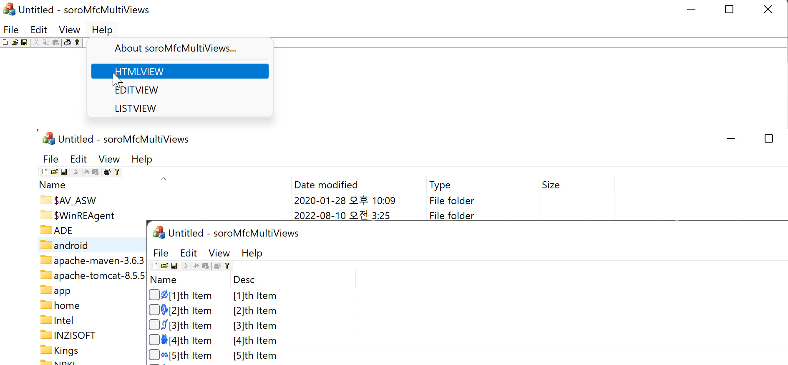

### Views 만들어 메뉴에서 변경 해 보기
---
##### 프레임웍으로 SDI 만든 후
##### 사용자 정의 view 3개 만들어 사용해 보기
[ref MFC 다중(switch)views](https://www.youtube.com/watch?v=OK7kCGBw0g8&list=PL7mmuO705dG2zFLKevTtK7eyTzmLxXY4W&index=52)
